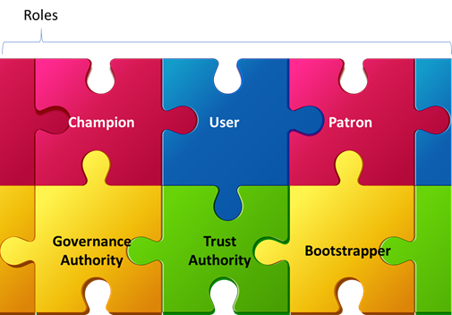
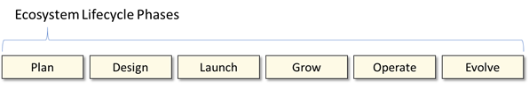

## Question: What are the key strategies for establishing a stable ecosystem environment, while promoting inclusivity, innovation and cross industry involvement?

There are many roles a government can and should play within an ecosystem intended to serve its citizens. The roles, responsibility and level of commitment will evolve throughout the lifecycle of the ecosystem, so it is reasonable to think about each role not just in terms of what, but also in terms of when and how much.

* **Government as ecosystem champion**: The desire to implement the conceived ecosystem originates with the government and therefore it is natural that this role is core to everything that will transpire. ‘Championing’ the ecosystem will look different throughout the lifecycle phases. Early on being a more all-encompassing role, later taking on a more targeted approach.
* **Government as ecosystem user**: In the early growth days, the government should play the role of lighthouse user in order to educate potential participants by example, demonstrate the value that can be realized through participation and educate the ecosystem community by way of real-world pressure testing. As the ecosystem begins to mature, the government in the role of a large user, can both provide a level of stability to the community and potentially act as a significant customer to vendors and service providers. These actions are in addition to the direct benefits realized from the use cases employed by the government at-large to drive specific social goals.
* **Government as ecosystem patron**: As a patron, the government is in a position to invest various amounts and types of resources to build momentum across the ecosystem. They can also use patronage during later phases to jumpstart innovation initiatives and support important activities when faced with unforeseen challenges.
The response to question 12 describes a number of areas where the government would be a prime candidate to take ownership of with the intent of promoting early growth and maturing the ecosystem. Specifically, the Layer 1 utility and personal wallet. This would entail patronage along with ownership, both of which would be reduced over time.
* **Government as governance authority**: As the top level of trusted entities within a jurisdiction, the government, willingly or unwillingly must take ownership in defining certain rules of engagement. Public companies, trade associations, international groups, etc. will also establish rules of engagement within their own domains, but there are several key issues related to the ecosystem that the government should give strong consideration to proactively taking ownership of:

  * Liability rules associated with the issuance, processing and transmission of credentials
  * Authority and authorization to demand presentation of certain credentials
  * Trust assurance standards for: public identity, public licenses, public health, etc.
  * Rules pertaining to vertically integrated use cases (use cases that require controls, or a chain of authorization from issuance through verification) involving public health, inclusion, diversity and commerce
 * Rules pertaining to discovery and access by law enforcement

* **Government as Authoritative Issuer/Trust Authority**: Ideally, the government won’t be the exclusive source for trusted identity, but initially they are the gold standard for the population at large and have significant infrastructure in place to keep identity current. The government should continue to provide free basic identity credentials to everyone in their jurisdiction. The government however should not attempt to be the definitive source for all use cases. The concept of identity is becoming increasingly rich and is the compilation of a lifetime of recorded interactions and authoritative claims. By this definition of identity, the data principle, not any third party, should always retain control of their information.

For credentials other than identity, the government must continue to act as a trusted authority when appropriate. Licensing is a good example. A business license is meaningful only if issued by the government or by an authorized agent of the government. The license is also meaningful only so long as the government remains a trusted authority.

* **Government as bootstrapper**: The response to question 12 explores this in greater detail, but the government is in a unique and highly leveraged position to seed the ecosystem with identity, create an operable (issuer, holder, verifier) ecosystem, then open it up to private and government organizations to innovate on top of. This, along with vision and purpose, is a rare combination event that will enable this ecosystem which derives value from scale to be bootstrapped at scale very early in its existence.
