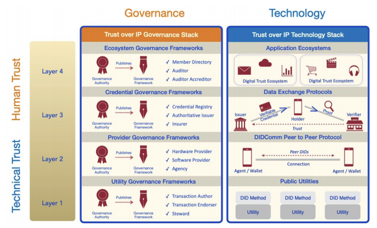
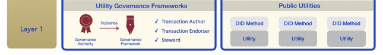

## Question: How can ecosystems comprised of both public and private sector entities be arranged to support the development of digital trust solutions?

Different regions, countries, states and jurisdictions will present varying ways of combining government oversight, regulation and direct delivery with private sector services and solutions to support the exchange of digital credentials. Together, in varying combinations, these actors will constitute a network of peers with some members playing key roles in governance and oversight.

The ToIP stack helps clarify where public sector actors  play an appropriate role by defining the business rules, regulations and policies required to support a digital trust ecosystem before technology decisions are made and implemented.

Digital trust solutions ("trust ecosystems") that exist entirely in the private sector, without the key Issuers from the Public Sector (F/P/T, municipalities, public utilities, etc.), will be limited in value and scope. The identity anchors that the public sector provides and the trusted exchange that they require to be more effective and efficient are crucial to driving demand and innovation in the trust ecosystem.

Similarly, a lack of private sector involvement would create trust ecosystems that struggle to respond to changes and innovations driven by the market and, as a result, will be very limited as well.

Depending on where we are focused in the ToIP stack, recommendations for the development of trust ecosystem will vary  as far as the roles and interplay between the public and private sector participants.

### Public Identity Utilities (Layer 1)

The primary purpose of Layer 1 in a trust ecosystem is to provide an “anchor” for key information (DID, DID Documents, key definitions/schema, etc.). The broad availability of Layer 1 is the key to an ecosystem. Adding complexity at Layer 1 is not recommended as any complexity multiplies at higher layers in the ecosystem.

Layer 1 approximates a pure “utility play” meaning it will, in time, become routine, predictable, and should be available for all citizens and organizations. Layer 1 is used to anchor key data from organizations (note: ToIP Layer 1 utilities should not be used for personal data/PII) and it provides a “source of truth” functions. ToIP Foundation recommends that organizations work in concert as peers when possible. Where there are very discrete needs to be “public sector only” or “private sector only” Layer 1 utilities should be very clear why this separation is a “must”.

For early efforts, a public ledger may suffice or a ledger could be established with a partnership of public and private sectors. Once the deep governance requirements are understood, discrete ledgers could be established based on business needs, though discussions between experts in the Trust Over IP Foundation have rarely found use cases for deeply separated Layer 1 utilities.

### Peer-to-Peer Protocol (Layer 2)
For the purposes of a trust ecosystem discussion, we will skip Layer 2 as it relates to communications and storage that don’t require ecosystem focus at the current time.

### Information Exchange (Layer 3)

The governance of various parts of the trust ecosystem may require separation of key public sector and private sector roles on a Governance basis but should align on a Technology basis. We will use an example to explain:

Consider the interplay between two portions of a national trust ecosystem:

* High-Assurance Digital Identity: Consider a “digital identity card” that provides driver licensing, OHIP, and perhaps other government-issued information. The Governance of this system should (must?) be led by the government - though it may benefit from a partnership with other public sector players. Knowing the definitive list of Issuers is crucial. Otherwise, the system would be ripe for fraud. Establishing the schemas that will be supported should be controlled by the public sector - but parties throughout the trust ecosystem should be consulted when creating these schemas.
* Digital Insurance Ecosystem: Consider an insurance industry ecosystem that links people and organizations as part of the trust ecosystem. Given a public sector foundational identity capability can be linked to, the likely lead organizations for the Governance of insurance industry ecosystem are private sector organizations. Public sector organizations certainly play an important role in this ecosystem but they are more likely to be consumers (Verifiers) than the drivers of the ecosystem needs.

Both of the above examples will benefit from a coordinated Technology Stack that supports both parts of the trust ecosystem. Otherwise neither system can leverage the other - creating new siloes.

Information exchange in a trust ecosystem rarely provides a bright line delineating between public OR private sector lead roles.

On the Technology Stack side, the Trust Over IP Foundation is currently developing ToIP Interoperability Profiles (TIPs) that will, in time, be suitable for adoption by trust ecosystems. These TIPs are intended to provide clear guidance and proof of interoperability across Layers 1 through 3 of the ToIP stack.

### Application Ecosystems (Layer 4)

Layer 4 addresses the requirements for building and maintaining trust ecosystems - the user-facing applications and tools that can be used. As such it is a logical partnership area for public and private sectors to collaborate. However, key areas need to be considered such as standards, protocols, auditing, and compliance.

For an explanation, we’ll use the same High-Assurance Digital Identity and Digital Insurance ecosystems, which we discussed in the prior section.

The High-Assurance Digital Identity Ecosystem would establish the requirements for the full ecosystem. Issuers, in particular, would be held to a standard for each level of assurance that they provide. This approach aligns very well with the Pan-Canadian Trust Framework. While the ecosystem may allow non-government credentials to be issued, they would most likely not be as high-assurance as some government-issued credentials. The key processes that happen before a citizen or organization (Holder) is given a credential by the government (Issuer) are simply more robust and secure.

The Digital Insurance Ecosystem would have its own rules for operating that are somewhat unique to the insurance ecosystem’s requirements.

The key that helps is that both of these components of the trust ecosystem would be crucial for both groups. Two simple examples that tie things together will help here:

* Governments require an efficient and effective way of requesting “proof of insurance” from people and organizations. They may also want to limit the use of the credentials that they issue:

  * A digital identity credential may be presented differently depending on who the Verifier is:

    * An “age of majority” (or any age threshold) may present a semi-anonymous proof that a person is over a certain age. The government may set the thresholds (e.g. over 18 for voting; over 19 for alcohol and cannabis) that are allowed by applications that are allowed to operate in the ecosystem.
    * A full sharing of a high-assurance digital identity credential may be limited to known agents - such as law enforcement and government officials.

* Organizations in the insurance industry required high-assurance that an individual or organization is who they say they are to smooth out processes and reduce fraud. Similarly, the people and organizations in the insurance ecosystem want consistency and simplicity.
