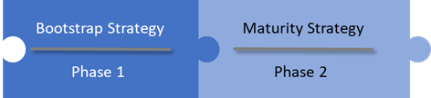
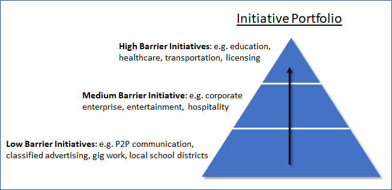

## How can an ecosystem effort maintain sustainability while creating the necessary conditions for inclusion, competition, innovation, private sector investment and participation in the creation of a financially viable digital identity ecosystem?

The ideal approach requires two distinct phases:

1. Creating the conditions that drive rapid, early adoption; and
2. Creating the conditions that ensure innovative growth and operational sustainability.

The two phases are tightly interlocked and each is critical for achieving sustainability, viability and long-term value generation for participants of the ecosystem.

A viable digital identity ecosystem requires the ability to sustain critical mass of participation among issuers, holders and verifiers. These participants, in turn, rely on the existence of a healthy supporting ecosystem of vendors, service providers, standards bodies, legislators and others.

Network effects dominate digital identity ecosystems in that the value realized by participants tracks closely to the number of participants and the amount of participation. There are many examples of this effect in our daily lives to look to for guidance: telecommunications, social media, transportation, web browsers, email and the power grid to name a few. Four aspects that are key to the success of each include the ability to:

1. Keep the cost of core infrastructure and operations low for the majority of participants
2. Keep barriers to adoption low for the majority of participants
3. Maintain a critical mass of participants and participation
4. Ensure the incremental costs for transacting across the infrastructure is low compared to alternatives

In this respect the Ontario government can be a very powerful lever, biased for broad social benefit, to assist in achieving the first three conditions which in turn will drive early adoption and help achieve critical mass of participation. The differentiating value the government can offer over that of the private sector is the ability to facilitate growth and adoption that enables a diverse set of private goals and agendas. The fourth aspect; transaction costs, will be driven by market forces.

### Phase 1: Bootstrap Strategy

#### Keep the cost of core infrastructure components low
The core of an identity ecosystem is built on top of internet infrastructure and is by design decentralized. The advantage being that large amounts of infrastructure rollout is not necessary.  Maintaining a set of interoperable distributed ledger(s) – the so-called layer-1 ‘utility’ layer however is one such infrastructure requirement. The government is well suited to take a direct role in establishing this as a public benefit and ensuring its long-term stability.

Direct investment, tax incentives, subsidized access to (network) resources and issuance of public/private contracts are tools that can be leveraged for developing, deploying and maintaining the level 1 utility.

#### Keep barriers to adoption low
Issuers, holders and verifiers all need to be activated for the ecosystem to function and each will require different levels of time and financial commitment. The most decentralized role by far in the ecosystem is that of the holder. As such it will always be hard for the average citizen to assign a monetary value to the use of the system.

Until business models develop that can hide the cost of user agents (wallets) from the holders, the government should take a direct role in subsidizing the cost and enabling wide scale distribution of these for free or very low cost to the end consumer.

There should be light subsidies or incentives available to encourage development of verification technology, and integration of verification technology into commercial businesses.

Issuers will initially represent the smallest group of participants and will feel pull and market incentives from holders, verifiers, industry groups, etc. to supply the ecosystem with credentials. The ecosystem will permit issuers to effectively monetize their good reputations by applying their name to the issuance of a credential. For these reasons, the government should monitor uptake but not plan on facilitating pro-active incentives.

#### Maintain a critical mass of participants
Governments are in a unique position in that they are already in the business of identifying and proofing a great number of people and institutions within their jurisdiction. It is also the case that they generally represent the ‘gold standard’ for basic identity and that basic identity is the foundation for literally everything that can transact across the ecosystem. Being the issuer of record for basic identity credentials, the Ontario government could seed the entire province almost overnight. Once individuals and corporations take possession of their credential by downloading it to their agent (wallet), the trust triangle of issuer:holder:verifier is completed and the ecosystem can function at scale. It is hard to emphasize enough the value that can be realized by seeding the ecosystem like this.

#### Create an innovation vacuum welcoming to all
Following the previous three strategies, the resulting ecosystem would be operational at large network scale, could function at low cost to participants and would exhibit high identity trust but low utility – creating a vacuum for innovators to fill. This creates fertile ground and a level playing field for enterprising individuals and organizations to innovate on top of.

Obtaining network scale is hard work. Building from scratch tends to motivate successful participants to consolidate control which can restrict broad based innovation. By bootstrapping identity at scale and providing targeted support to infrastructure components, the Ontario government can both significantly reduce the time it takes to reach critical mass and spread the opportunities derived from having critical mass across a wide range of constituents.

### Phase 2: Maturity Strategy

#### Mature ecosystem
Ecosystem Maturity can mean many things, and it would be hard to imagine all the future possibilities. However, one relatively safe definition of this milestone would include the abilities of the ecosystem to:

1. Operate stably and fairly
2. Provide wide ranging value to participants
3. Evolve through ongoing innovation
4. Be paid for primarily by the activity of the free market

Attaining this state of maturity would permit the government to transition their resource commitments from subsidizing core ecosystem components to targeted investments and incentives that drive specific innovations, efficiencies and public policy goals.

Getting to this milestone will involve monitoring and continuation of bootstrap policies adjusted to a level that ensures stability and confidence, but the main focus should be on outreach, external investment and growing the number of participants and level of participation, specifically of issuers and verifiers.

A portfolio approach that targets groups of high barrier initiatives, medium barrier initiatives and low barrier initiatives will attract a vibrant mix of participants and use cases. Each group will require a different approach and level of involvement from the Ontario government.

Regional workshops co-sponsored by software vendors might be a great outreach program to encourage low barrier initiatives to flourish. At the other end of the spectrum, the government might need legislative change to enable licensing use cases, privacy protections or assumptions of liability.

Encouraging a healthy vendor and services industry as well as interoperability standards should also be high on the agenda. Working closely with industry to define or adopt interoperability standards, either formal or de-facto is very important in maturing the ecosystem and encouraging broad participation from large and small organizations alike.
