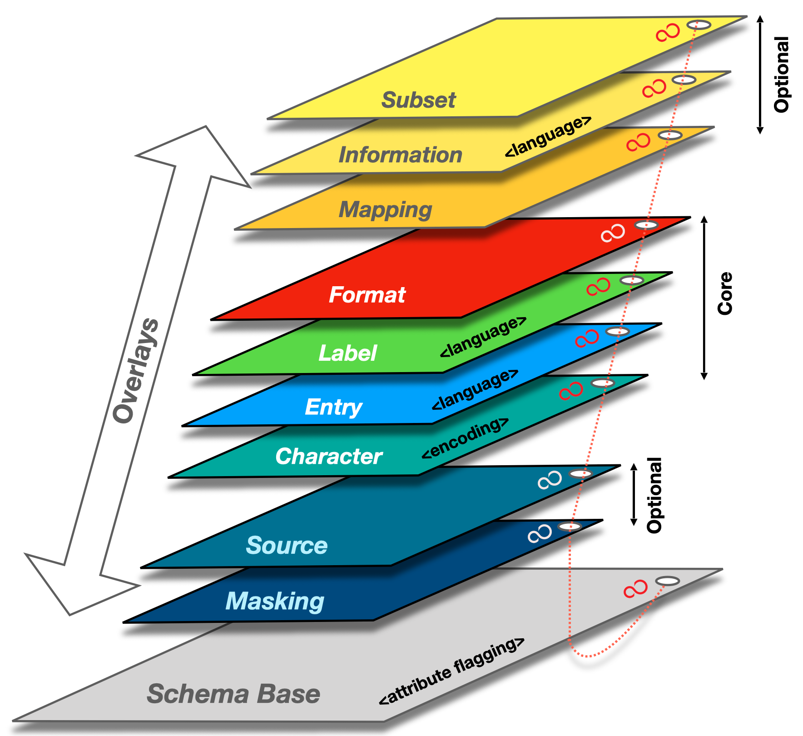

## Question: What are the minimum set of common attributes/features that a digital identity should include?

Short answer: It depends.

One needs to make a distinction between key management, claims and mechanisms required to authenticate (i.e data entry [Inputs domain]) and attributes, purpose and consent required for information exchange (i.e. data capture [Semantic domain]) between government, business or individuals. From a governmental perspective this distinction is required to ensure that flexibility is governed and available to all stakeholders. Without this flexibility, inclusiveness of a government digital identity system will be difficult to implement (e.g. impossibility to sustain the variety of attributes/features for all economical actors).

The components/features of a digital system require solid interplay between both domains (Inputs & Semantic).

Digital identities clearly sit in the authentication space but their real life usage requires the information exchange piece. The Trust over IP Foundation Semantic Domain Working Group was established to deal with the data capture side of things (i.e. information exchange) but, since the interplay is so closely bound, that WG will likely be evolving to deal with both authentication and information exchange. The revised WG name will likely be the Inputs and Semantics Working Group.

### Authentication (Inputs domain)
Let’s first look at the authentication space. Identity key management refers to the requirements by a stakeholder to ensure that it is interacting with an assured counterparty in a secure and authenticable manner. It is thus highly ecosystem dependent and application specific. As opposed to having one super ID credential consisting of a large number of form attributes with multiple features, we need to focus on strong ID credentials.  In certain circumstances, even basic form attributes like names are not necessary for authentication.

As an example, we can use a scenario inspired by the current COVID-19 pandemic where large scale testing is of importance. In this case, for public health reasons a comprehensive coverage of the population is necessary and, for some applications,  only a proof of having been tested is necessary, not citizenship or any other PII.

For authentication purposes, Verifiable Credential claims should remain as simple as possible. A government will have to foster a graded authentication system for sake of user acceptance and complexities (cost) of implementation. Here again, the level of authentication will not only be ecosystem and application dependent but also contextual. With respect to a driver’s license, authentication requirements will be different if you have been arrested by a police officer for drunk driving or if you are using this credential only as a proof of age.

Thus design of VC forms, when used as digital identities, should carefully weigh the intended usage with the payload content. Proper segmentation and reference to other VCs where appropriate is a good design to limit data overloading of VC. For example, a driver’s license includes a date of birth. However, that information is present in a birth certificate, so rather than duplicating the data, the driver’s license VC should reference that claim in the driver’s birth certificate VC if available. In addition to avoid duplication, this approach is more secure as it ensures that the linked VC is still valid.

### Information exchange (Semantic domain)
If the Authentication section can be summarised as “knowing who is your counterparty”, the Information exchange section should be “knowing what you are talking about”. In many scenarios, digital identity can stop at the authentication level (e.g. holder is allowed to enter premises) but in many more scenarios it is the data payload attached to the identifier that is relevant for  electronic transactions (e.g. diploma, electronic health record,...). Thus a decentralized authentication system must be accompanied with a decentralized semantic solution allowing each side of the electronic transaction to ensure transparency in the actual information exchange.

At this stage, the ability to recompose the data in ways that preserve privacy is a must. For example, buying at the LCBO currently requires a presentation of ID that includes date of birth. However, ultimate privacy protection should require only a picture (to match to the individual) and an assertion that the person is over 19. For a single claim, this could be cryptographically solved with a VC and zero-knowledge proof (ZKP). However, when the data payload is large enough to warrant a dedicated container or data store to hold data with a VC providing a transitive trust component for authorized access, a ZKP-compliant VC is not sufficient. In this case, a data capture architecture that can support rich contextual definitions through semantic object interoperability is needed for real world complexities.

Overlays Capture Architecture (OCA) is an architecture that presents a schema as an object consisting of a schema base and overlays. Overlays are task-oriented linked data objects that provide additional extensions, coloration, and functionality to the schema base. This degree of object separation enables issuers to make custom edits to the overlays rather than to the schema base itself. In other words, multiple parties can interact with and contribute to the schema structure without having to change the schema base definition. With schema base definitions remaining stable and in their purest form, a common immutable base object is maintained throughout the capture process which facilitates data standardization and data language unification.

In conclusion, the list of requirements to be included in a digital offering must distinguish the authentication and the information exchange solutions to ensure the required flexibility of a deployed provincial- (nation-) wide digital identity system.

### Core data schema development
Spearheaded by contributing members from MyData Global and Trust over IP, a [core data schema](https://protocol.jlinc.org/core-data-schema/) is currently being defined for capturing personal identification and demographic data for active governing entities.

The [schema requirements document](https://docs.google.com/document/d/1-smCcC_Tab7KSuWdaMJCk7mY7zCBoNBk7wSYoHmZPiw/edit ) is being developed by contributing members of the MyData Operators WG at MyData Global.

The schema technical specification is being developed by contributing members of the Semantic Domain WG at the Trust over IP Foundation.

Here is a visual representation of the core data schema in OCA format:

### Blinding Identity Taxonomy
The Blinding Identity Taxonomy (BIT) is a defensive tool created for the purpose of reducing the risk of identifying governing entities within blinded datasets. BIT contains a list of elements to be referred to by schema issuers for flagging attributes which may contain identifying information about governing entities. Once attributes have been flagged, any marked data can be removed or encrypted during the data lifecycle.

OCA contains a blinding block in the schema base object that enables issuers to flag any attributes that could potentially unblind the identity of a governing entity. The BIT is the suggested reference for those schema issuers.

The [BIT](https://wiki.trustoverip.org/display/HOME/Semantics+Working+Group#SemanticsWorkingGroup-BlindingIdentityTaxonomy(BIT) Report is an official [Kantara Initiative](https://kantarainitiative.org/) report:

* [BIT Report - PDF format](https://docs.kantarainitiative.org/Blinding-Identity-Taxonomy-Report-Version-1.0.pdf)
* [BIT Report - HTML format](https://docs.kantarainitiative.org/Blinding-Identity-Taxonomy-Report-Version-1.0.html)
