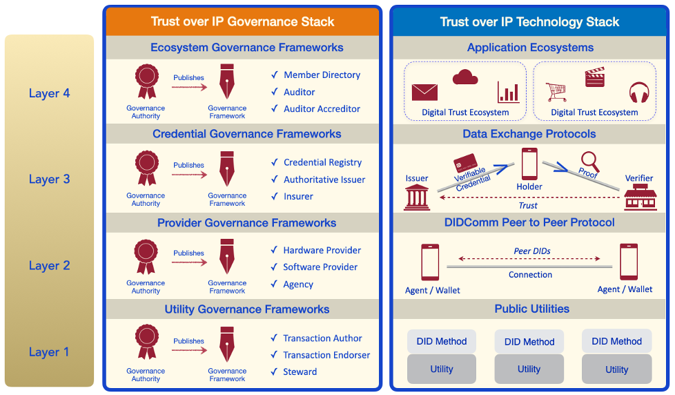

# ToIP FAQ

## Purpose
This white-paper provides ToIP answers to frequently asked
questions pertinent to the maturation of successful ecosystems within a digital trust marketplace.

## Overview
The Trust over IP (ToIP) Foundation was launched in May 2020 as an independent project hosted by the Linux Foundation. As such, ToIP itself is a relatively new contributor in the area of verifiable credentials and decentralized identifiers.

Nevertheless, ToIP members include over 170 leading companies, organizations and individual contributors sharing expertise and defining standards / specifications to advance a secure trust layer for the digital world. In this sense, ToIP brings vast and long-established experience and expertise to its effort to define a complete architecture for Internet-scale digital trust combining cryptographic trust at the machine layer with human trust at the business, legal, and social layers.

In order to enable trusted transactions and relationships online, credentials need to be founded on governance frameworks that spell out the business, legal, and technical rules under which they operate. This is how ToIP proposes to move beyond mere technology “proofing” and foster the emergence of solutions that interoperate at scale: by putting governance first.

Applications that foster digital trust begin with​ a clear understanding of business requirements​, then move to ​regulatory and policy requirements​ that are transparently communicated in complete governance frameworks. Only at this stage, when the parameters for creating real human trust are fully articulated, are technology components selected to implement a solution.

This is the insight reflected in ToIP’s dual stack model:

ToIP aims to break from the thousands of siloed solutions for digital identity and credential issuance that do not work with each other. This lack of interoperability costs billions of dollars per year in complicated and time-consuming integration and hinders adoption by the very customers they purport to serve.

Our goal is to drive adoption of a new model for digital trust that is every bit as interoperable as the physical wallets and paper or plastic credentials that we use every day—to do everything from getting on a plane to entering a hospital to signing a mortgage. As these new tools emerge, they will become as essential to our digital lives as browsers and email clients have become to the Web today. Interoperable solutions are paramount for a vibrant digital marketplace where consumers are free to choose the vendors and use the digital credentials they prefer.

ToIP aims to define a complete architecture for Internet-scale digital trust that combines cryptographic trust at the machine layer with human trust at the business, legal, and social layers. The Foundation’s mission is not to develop all of the standards or components included in the ToIP stack. It is to specify how these elements can be combined to fulfill the requirements of all four layers, bringing both governance and technology together.

ToIP Foundation works closely with other standards development organizations (SDOs), industry foundations, and consortia to combine their open standards, architectures, and protocols into a complete and coherent stack for Internet-scale digital trust.

For a more complete outline of the ToIP Foundation and its mission, please refer to our [founding whitepaper](https://trustoverip.org/resources/intro-to-toip/) or [interactive portal](https://trustoverip.github.io/WP0010-toip-foundation-whitepaper/).
