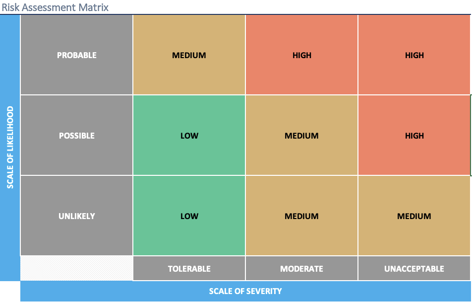

## Question: What are some concerning risks and how best are they  mitigated?

The Trust Over IP Foundation strives to promote open and generally accepted global standards and practices for the betterment of the commercial, private and public sector use of the Internet.  Our recommendations are subject to a fluid and changing technological landscape. As such, addressing risks requires an approach that is just as nimble as flexible as this ever-changing environment.

The Governance Authority (“**GA**”), or Credential Issuer (“**Issuer**”), which adheres to the established Governance Framework (“**GF**” ) must make efforts to assess and proactively manage potential risks associated with the issuance, holding and verification of credentials. The level of effort applied to risk assessment and management must be determined exclusively by the GA or Issuer along with potential advisors, and should be based on whatever risk mitigation such entity considers to be reasonable for the associated stakeholder group. The following guidelines for a GA or Issuer are recommended for risk assessment and management efforts. As such, any GA or Issuer:

* SHOULD identify key risks that MAY negatively affect the achievement of the GF's purpose within its scope,
* SHOULD include a Risk Assessment process output that provides an assessment of each key risk that the GF is designed to address and mitigate,
* SHOULD assess which Roles and Processes are vulnerable to each risk and how they are affected,
* SHOULD include a Risk Treatment Plan (RTP) for how identified risks are treated (e.g. mitigated, avoided, accepted or transferred),

If a GA or Issuer is unfamiliar or not comfortable completing a risk assessment process, along with an appropriate risk management plan, it is recommended that capable advisory support be engaged. However, any decision on how to proceed with this process is at the total discretion of the GA or Issuer. Ultimately, the results of any risk assessment and management effort should be published as one or more supporting documents that are readily available for any credential Issuer, Holder and/or Verifier to review in full.

ToIP offers the following list of potential risk categories for assessment in Table 1. This list is not comprehensive, and other categories may be required for specific situations. Similarly, any number of the risk categories in Table 1 may be determined to be unnecessary. The ultimate range of risk categories considered by any GA or Issuer can only be decided by such GA or Issuer, potentially with input from qualified advisors and stakeholders.

### Sample Risk Categories

#### Governance Authority Risks
1. Lack of competence to perform role
0. Lack of appropriate authority
0. Ecosystem Lacks Jurisdictional Acceptance
0. Ecosystem Lacks Industry Acceptance
0. Ecosystem Allowing Inappropriate Actors to Participate in Network

#### Issuer Risks
6. Credential Issued without sufficient basis
0. Credential Issued before appropriate proofing of basis
0. Credential Issued in the wrong format or structure
0. Credential issued to impostors
0. Issuer Practices Not Accepted by Ecosystem

#### Verifier Risks
11. Lack of consistent verification practices
0. Evidence of verification incomplete or in incorrect format
0. Verifier Practices Not Accepted by Ecosystem
0. Suspended Credential Being Accepted
0. Revoked Credential Being Accepted

#### Credential Registry (Ledger) Risks
16. Lack of competence to perform role
0. Unavailable registry
0. Inappropriate access writes to registry
0. Breach of registry
0. Exploited Use of Stolen Credentials
0. Credential Registry Not Accepted by Ecosystem

#### Credential Holder Risks
22. Counterfeit Credentials Being Created
0. Credential Holder Given Inappropriate Access Rights
0. Imposter Using Valid Credential
0. Credential Wallet Private Key is Compromised
0. Credential Holder's Private Data is Compromised
0. Social Engineering Attacks Successfully Gather Credentials by Perpetrators

#### Utility Operation Risks
28. Stewards Not Abiding by Governance Practices
0. Inadequate Infrastructure Supporting Steward Operations
0. Inadequate Network Throughput Supporting Steward Operations
0. Inadequate Network Availability Supporting Steward Operations

### Sample Risk Assessment Methodology
Deeper analysis of risks items and their potential impacts is beyond the scope of the GF, because it is necessary for this work to be done by GAs and Issuers. However, a simple approach to risk assessment can be calculated using the approach below, which follows guidance from the ToIP Governance Metamodel previously referenced. The potential impact (“**I**”) of any risk item is the product of the likelihood (“**L**”) of a risk incident occurring multiplied by the outcome severity (“**S**”) that would be incurred due to such incident. Quantitative values for likelihood and severity should be assigned by the risk assessment team, and resulting values can be partitioned into numerically scaled groupings of LOW, MEDIUM and HIGH impact.

```
              L x S = I
```

The above approach for estimation of risk impact can then be used to show a distribution of risk items by plotting the risks items in a two dimensional table, such as the sample table shown below. This visualization enables the risk assessment team to have a consolidated view of all risk items, and start to develop a risk management plan for the set of risk items that are considered to be critical for inclusion in such a plan.



We recommend that the Governance Authority create a Risk Treatment Plan for HIGH risks but should also consider a plan for MEDIUM risks.

Generally accepted risk assessment methodologies advocate that some risks may be avoided, transferred or just accepted.  The risks that can be mitigated should be attached as control requirements by the Governance Authority to other stakeholders whose accountability could be monitored as part of a Trust Assurance scheme.
